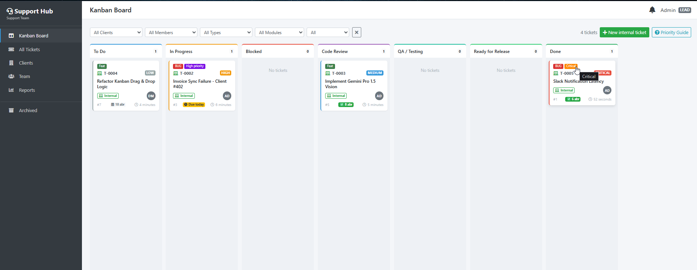
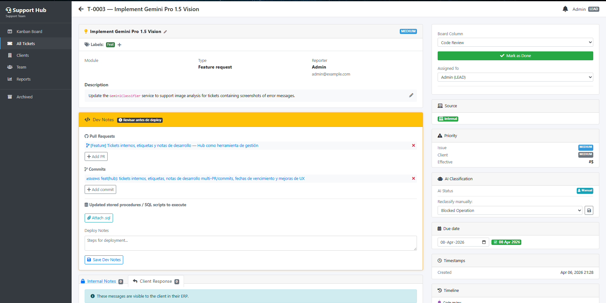
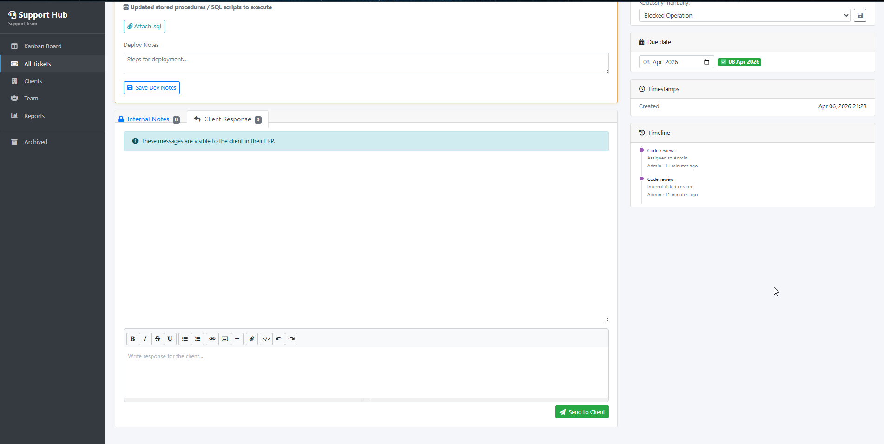
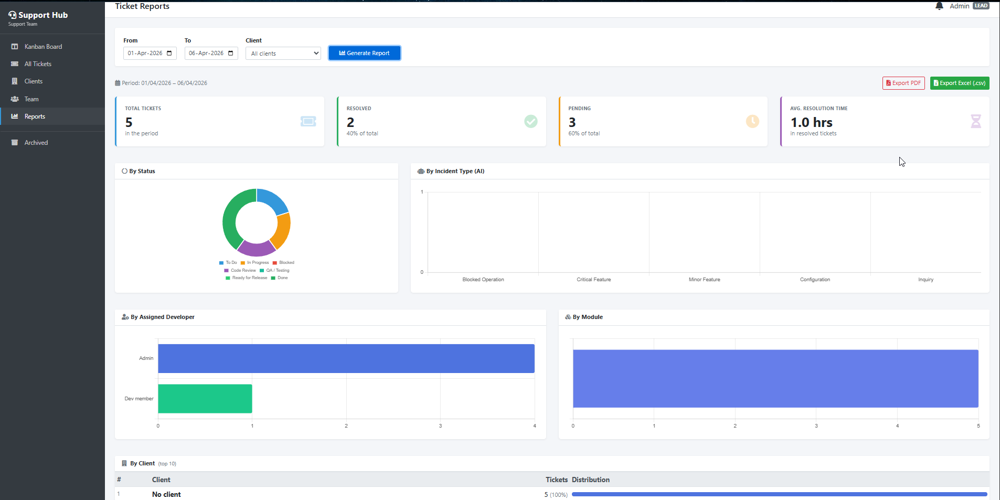

# Support Hub

Support ticket management system with Kanban board, AI classification (Gemini), Slack notifications, and REST API integration for any ERP or business system.

> This project was originally built for a real-world ERP and electronic invoicing company in El Salvador and has been adapted as a generic open-source solution. It has been running in production and is designed to integrate with any business system via REST API.



## Features

- **Kanban board** — drag & drop tickets across configurable columns (To Do, In Progress, Blocked, Code Review, QA Testing, Ready for Release, Done)
- **REST API** — receive tickets from any external system (ERP, CRM, e-commerce, etc.) via API key authentication
- **AI classification** — automatic ticket categorization using Google Gemini (optional)
- **Slack notifications** — real-time team alerts on ticket creation, movement, and replies
- **Bidirectional communication** — reply to clients from the hub; replies sync back to the source system
- **Multi-client** — manage tickets from multiple clients/companies in a single hub
- **Internal tickets** — create internal tasks (bugs, features, questions) alongside client tickets
- **Team management** — roles (lead, developer, support), assignment, @mention in comments
- **Reports** — ticket metrics by period, client, priority, and incident type
- **Multilingual** — English and Spanish included






## Stack

- **PHP** >= 7.3 (tested on 7.4 / 8.2)
- **Laravel** 8.83
- **MySQL** 8.0
- **Frontend:** Bootstrap 4.6, jQuery 3.5, SortableJS, Summernote
- **AI:** Google Gemini (optional)
- **Notifications:** Slack Incoming Webhooks (optional)

## Requirements

- PHP >= 7.3 with extensions: `mbstring`, `pdo_mysql`, `openssl`, `tokenizer`, `xml`, `curl`, `zip`, `gd`
- Composer 2.x
- MySQL 8.0+
- Node.js / npm (not required — assets are pre-compiled)

## Installation

### 1. Clone the repository

```bash
git clone https://github.com/AdolfoSiseG/support-hub.git
cd support-hub
```

### 2. Install dependencies

```bash
composer install
```

### 3. Configure environment

```bash
cp .env.example .env
php artisan key:generate
```

Edit `.env` with your local settings:

```env
DB_DATABASE=support_hub
DB_USERNAME=root
DB_PASSWORD=your_password
```

### 4. Create the database

```sql
CREATE DATABASE `support_hub` COLLATE 'utf8mb4_0900_ai_ci';
```

### 5. Run migrations

```bash
php artisan migrate
```

### 6. Create admin user

Option A — with environment variables (recommended):

```bash
# Add temporarily to .env:
# ADMIN_NAME="Your Name"
# ADMIN_EMAIL=you@yourdomain.com
# ADMIN_PASSWORD=your_temp_password

php artisan db:seed --class=AdminUserSeeder
```

Option B — default values:

```bash
php artisan db:seed --class=AdminUserSeeder
# Creates: admin@example.com / changeme123
```

The system will prompt for a password change on first login.

### 7. Create storage link

```bash
php artisan storage:link
```

### 8. Start the server

With Laragon: the project is served automatically at `http://support-hub.test`

With artisan:
```bash
php artisan serve
# http://localhost:8000
```

## Optional configuration

### Gemini AI (automatic ticket classification)

1. Get an API key at [Google AI Studio](https://aistudio.google.com/apikey)
2. Add to `.env`:

```env
GEMINI_API_KEY=your_api_key
GEMINI_MODEL=gemini-2.5-flash
```

Without an API key, tickets remain with `ai_status=pending` and can be classified manually.

### Slack notifications

1. Create an Incoming Webhook in your Slack workspace
2. Add to `.env`:

```env
SLACK_WEBHOOK_URL=https://hooks.slack.com/services/xxx/xxx/xxx
```

### Connecting an external system (ERP/CRM)

The connection between your system and Support Hub is configured on both sides:

**In Support Hub:** Clients > Create client > copy the generated API Key

**In your system:** Configure the Support Hub URL and API Key, then POST tickets to:

```
POST /api/tickets
Authorization: Bearer {api_key}
Content-Type: application/json
```

See **[docs/api.md](docs/api.md)** for the complete API reference — all endpoints, request/response schemas, callback format, and an integration checklist to connect any system to Support Hub.

## Project structure

```
app/
  Http/Controllers/
    TicketController.php         # Kanban, detail, comments, assignment
    Api/ApiTicketController.php  # API endpoint for receiving tickets
  Models/
    Ticket.php                   # Main ticket model
    Client.php                   # Client companies
    TeamMember.php               # Team members
    TicketComment.php            # Internal comments and replies
    TicketAttachment.php         # File attachments
  Services/
    GeminiClassifier.php         # AI classification via Gemini
  Jobs/
    ClassifyTicketJob.php        # Async classification job
config/
  support.php                    # Priority and incident type constants
public/
  js/kanban.js                   # Kanban board logic
  js/ticket-detail.js            # Ticket detail logic
```

## Useful commands

```bash
# Clear cache
php artisan config:clear && php artisan cache:clear

# Re-run migrations (development)
php artisan migrate:fresh --seed
```

## License

This project is licensed under the [GNU General Public License v3.0](LICENSE).
